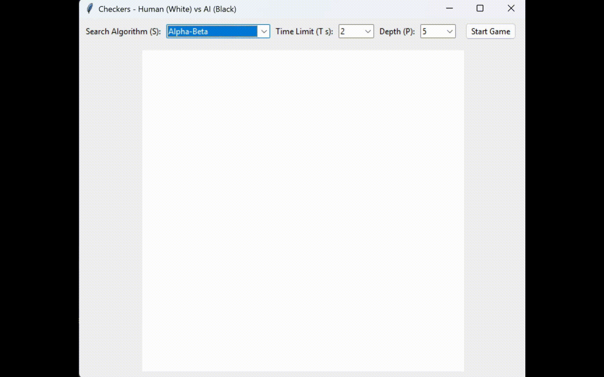

# ♟️ Checkers AI Bot

  

This project is a simple checkers game where a human player (white) plays against an AI (black) through a graphical interface. The game handles all standard rules (legal moves, captures, multi-jumps, and promotions), while the AI decides its moves using classic search algorithms. You can configure how the AI behaves before starting the game, allowing you to balance between speed and playing strength.

## ⚙️ Parameters

* **S - Search Algorithm**
  Chooses how the AI thinks. Options include Minimax (basic), Alpha-Beta (faster with pruning), and Alpha-Beta with move ordering (more optimized).

* **T - Time Limit (seconds)**
  The maximum time the AI is allowed to think for each move. If the limit is reached, it plays the best move found so far.

* **P - Depth**
  How many moves ahead the AI explores. Higher depth makes the AI stronger but slower.
